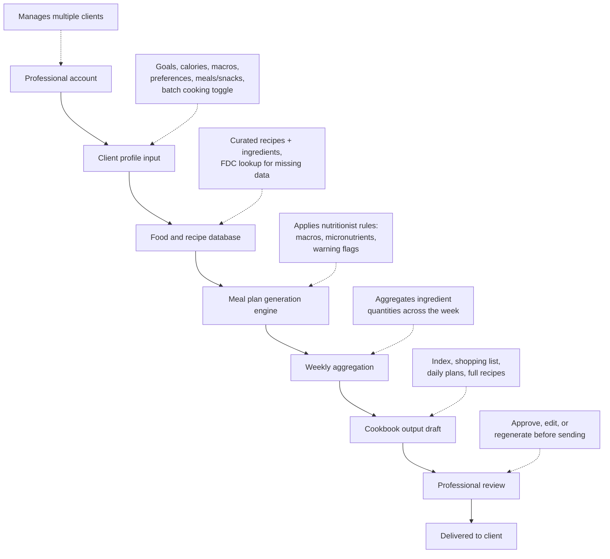

# Project proposal: nutrition meal plan generator

## 1. Concept
A professional-facing application that generates a full week of meals and snacks for a client, tailored to their goals, and delivers it as a printable, cookbook-style weekly plan — not a food tracker.

**Core differentiator:** meal plans generated from evidence-based nutritionist logic (calorie/macro targets, full micronutrient coverage, sensible meal structure), not just a calorie calculator matching foods to a number.

**Positioning against MyFitnessPal and similar apps:** those apps are built around logging what you already ate and reconciling against targets. This app removes that entirely — the plan is prescribed upfront, the client just cooks from it. No daily tracking, no macro-watching, no stress.

## 2. Target market
- **Primary (build first):** professionals — nutritionists/coaches — managing plans for multiple clients. Sequencing rationale: smaller, reachable audience (existing network via the gym), real-world testing before consumer launch, and the professional feature set (multi-client management) is a superset of what a single consumer needs anyway.
- **Secondary (later):** individual consumers, generating their own single-profile plan.

## 3. How it works — process flow

*(A visual version of this flow was also rendered inline in chat.)*

## 4. Method breakdown

### 4.1 Client profile input
- Inputs: age, gender, calorie target (or inputs to derive it), macro preference/goal (e.g. sport, weight loss, maintenance), food preferences/exclusions, number of meals and snacks per day, batch-cooking on/off
- Preferences act as hard filters applied before generation, not substituted after the fact

### 4.2 Food and recipe database
- Two-layer structure: an `ingredients` table (linked to USDA FoodData Central IDs where possible) and a `recipes` table referencing ingredients + quantities + method
- Recipes and ingredients are hand-curated (by Jemma) rather than sourced generically — this is where the "nutritionist POV" differentiator actually lives
- FoodData Central used as a fill-in/lookup layer for nutrient values, not as the primary content source
- Each recipe tagged for batch-cook suitability (stews, grain bowls, roasted veg, proteins batch well; salads, delicate fish, etc. don't)

### 4.3 Meal plan generation engine
- Applies the nutritionist rules doc (see companion file: meal-plan-nutritionist-rules.md) — calorie/macro targets by goal, micronutrient coverage (not just macros), sensible per-meal balance, fibre distribution, nutrient-pairing rules
- If batch cooking is enabled, deliberately repeats selected recipes across multiple days rather than optimising purely for daily variety
- Outputs a full week of meals/snacks meeting all constraints simultaneously (calories, macros, micronutrients, preferences)

### 4.4 Weekly aggregation
- Ingredient quantities are summed across the entire week's recipes (not per-recipe) to produce accurate shopping list totals
- Batch-cook entries are flagged with cook day + eat days (e.g. "cook Sunday, eat Tue/Thu/Sat")

### 4.5 Cookbook output
Final deliverable structure, in order:
1. Contents/index
2. Shopping list (aggregated weekly quantities)
3. Daily meal plans (meals + snacks laid out per day)
4. Full recipe per meal/snack (ingredients + method)

No calorie/macro numbers are surfaced to the client — they exist only to drive generation under the hood. The output reads as a static weekly cookbook, not an interactive tracker.

### 4.6 Professional review (approval layer)
- The generated cookbook is a draft until the professional reviews it — not sent straight to the client
- Professional can approve as-is, edit specific meals/recipes, or trigger a regeneration before it goes out
- Any warning flags raised by the rules engine (see rules doc — e.g. low protein for an older adult, high saturated fat) surface here for the professional to review and resolve, rather than being silently auto-corrected or silently ignored
- This is the point where professional judgement sits on top of the algorithm's output — keeps the professional accountable and in control of what actually reaches their client

## 5. Data & tooling approach
- **Database:** SQLite to start (free, file-based, no server needed) — upgrade path to PostgreSQL if/when multi-user hosting is needed
- **Data entry workflow:** recipes/ingredients entered in Excel first (easy to review/edit), then imported into the database via script — not built directly in a spreadsheet long-term
- **Nutrient lookups:** USDA FoodData Central (free, public) as the fill-in data source
- **Build environment:** Claude Code, once design/schema decisions are locked in

### 5.1 Database schema (draft)
Six tables:
- **clients** — id, name, age, gender, goal, bmr_equation (dropdown-selected per client), calorie_target, macro_targets, preferences, meals_per_day, snacks_per_day, batch_cooking_enabled
- **meal_plans** — id, client_id (FK), week_start, status (draft / reviewed / sent)
- **meal_plan_entries** — id, meal_plan_id (FK), recipe_id (FK), day, meal_slot, is_batch_cook, cook_day
- **recipes** — id, name, meal_type, method, batch_cook_suitable
- **recipe_ingredients** — recipe_id (FK), ingredient_id (FK), quantity, unit (join table)
- **ingredients** — id, name, fdc_id, calories_per_100g, protein_per_100g, carbs_per_100g, fat_per_100g (plus micronutrient fields as needed)

Relationships: a client has many meal plans; a meal plan contains many entries; each entry references one recipe; a recipe references many ingredients (via the join table) with quantity/unit per ingredient.

*(A visual ERD of this schema was also rendered inline in chat.)*

## 6. Regulatory considerations
- Scoped to general-public, goal-based plans (sport, weight loss, maintenance) — not disease-specific/clinical nutrition, which keeps this in nutritionist (not dietitian/medical) territory
- Standard disclaimer: not medical advice, consult a professional for medical conditions

## 7. Testing / rollout plan
1. Build professional-side MVP: client profile management + generation engine + cookbook output
2. Test with real clients via husband's gym — gather feedback on recipe quality, plan accuracy, batch-cooking usefulness
3. Refine nutritionist rules doc and algorithm based on real feedback
4. Evaluate consumer-facing version once professional side is validated

## 8. Open decisions (carried from rules doc)
- Exact macro ranges per goal category
- Which micronutrients are actively tracked vs. background-only
- Whether sodium/saturated fat are treated as ceilings in scoring
- Whether batch-cook eligibility is a fixed tag per recipe or judged dynamically

---
*Companion document: meal-plan-nutritionist-rules.md (detailed rules engine logic)*
